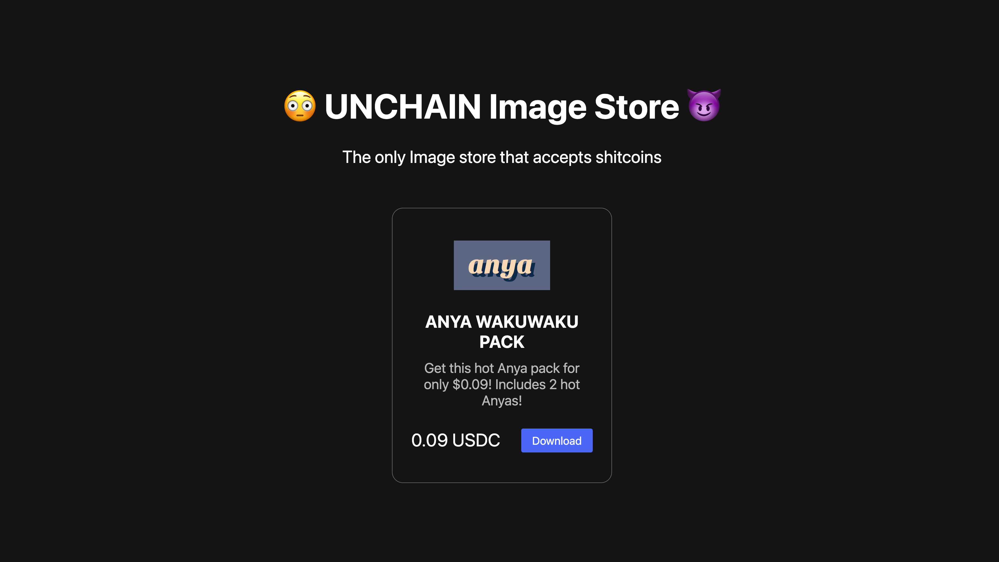
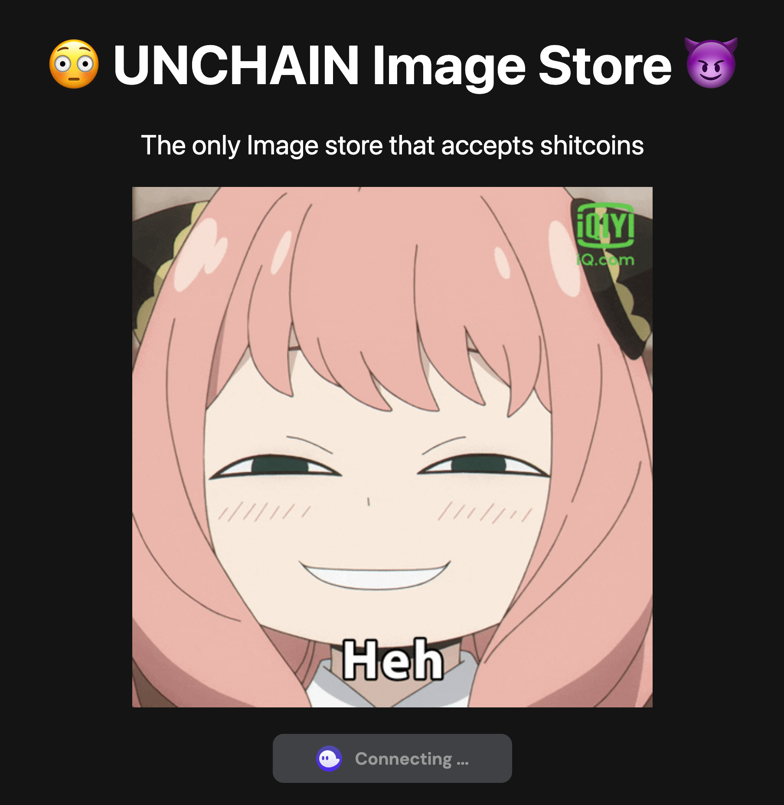
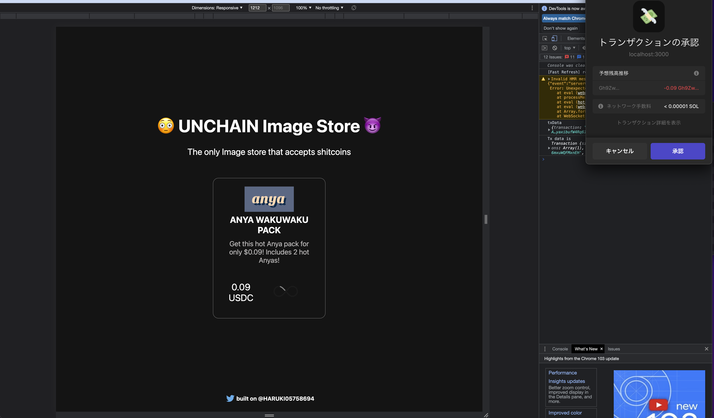
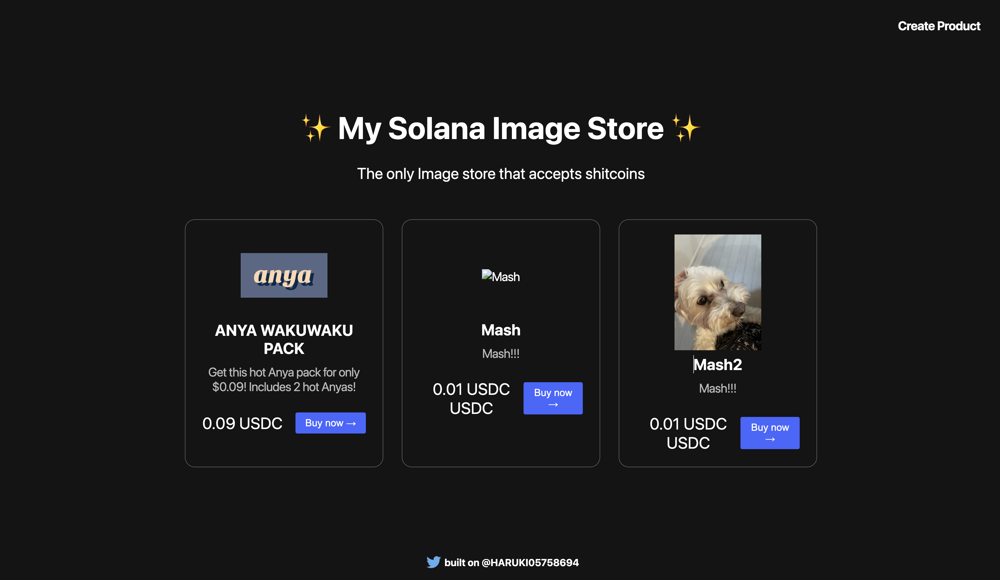

# SolanaStoreDApp
Solana上で動くオンラインストアDApp用のリポジトリになります。

### 起動するためのコマンド
 `cd client`  
 `npx next dev`

### ダウンロード画面
 

### ウォレットが接続されていないデフォルト画面
 

### 購入処理中のローディング画面
 

### 製品を新たに追加したときの画像
  

### メインネットで実行する場合

1. createTransaction.js で設定した テストネットの USDC SPL トークンアドレスを以下のとおりメインネットの USDC SPL トークンアドレスに変更します。

```text
const usdcAddress = new PublicKey("EPjFWdd5AufqSSqeM2qN1xzybapC8G4wEGGkZwyTDt1v");
```

2. _app.js 及び createTransaction.js ファイル内の WalletAdapterNetwork 関数内にある network を以下のとおり変更します。

```text
const network = WalletAdapterNetwork.Mainnet;
```